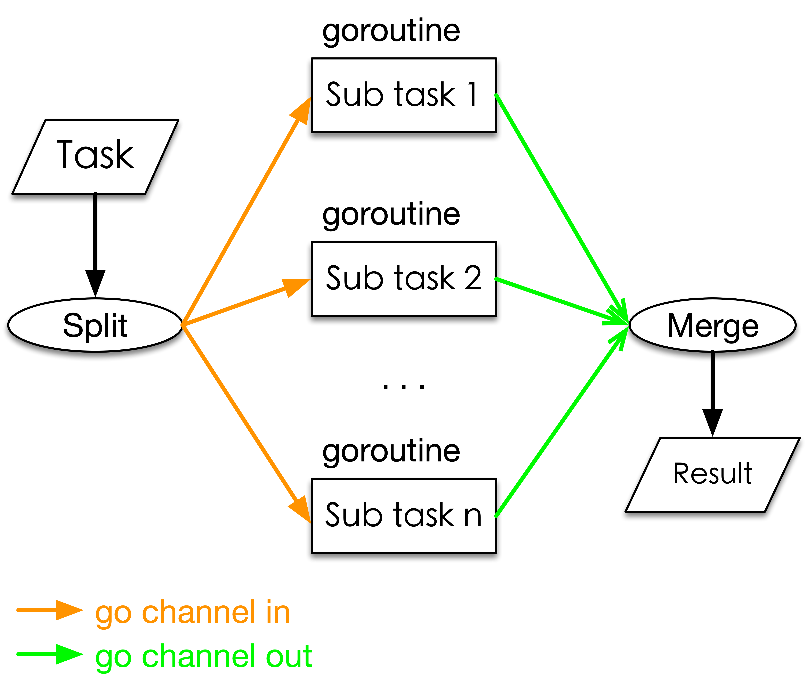

# CMSC 621 Advanced Operating System， 2022 Spring，[Prof. Kalpakis](https://www.csee.umbc.edu/~kalpakis/)

Class home page: [web](https://www.csee.umbc.edu/~kalpakis/courses/621-sp22/cmsc621.php), [pdf](./doc/homepage.pdf)

# HW
- HW1 Critique of the paper **Epidemic Algorithms for Replicated Database Maintenance** by Demers et al. 1987
- - [Paper PDF](./doc/hw1_rumor_mongering/p1-demers.pdf), [slides PDF](doc/hw1_rumor_mongering/slides.pdf)
- - [My Critique](doc/hw1_rumor_mongering/Critique_DayuanTan_v2.pdf)
- - [Directory for HW1](./doc/hw1_rumor_mongering/)

- HW2 Critique of the paper **Chord: A Scalable Peer-to-peer Lookup Protocol for Internet Applications** paper by Stoica et al (2001)
- - [Chord Paper PDF](./doc/hw2_chord/Chord%20-%20Stoica%20et%20al%202001%20-%20%20A%20Scalable%20Peer-to-peer%20Lookup%20Protocol%20for%20Internet%20Applications%20paper.pdf), and [other hw2 questions](doc/hw2_chord/hw2.pdf)
- - [My Critique](doc/hw2_chord/)
- - [Directory for HW2](./doc/hw2_chord/)

- [HW3]

# Projects

- Proj1 **Multithread, Concurrency** (goroutine, channel).
- - [My solution (code and doc)](doc/proj1_go_concurrency/).

- - 

- Proj2 **Client-Server Token Manager**, (PRC)
- - [My solution (code and doc)](doc/proj2_gRPC_ProtocolBuffer_Client-Server_Token_Manager/)
- - picture