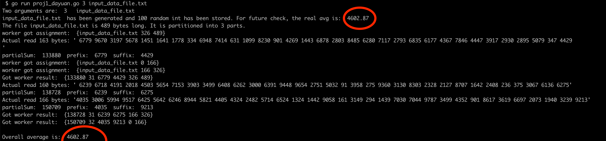
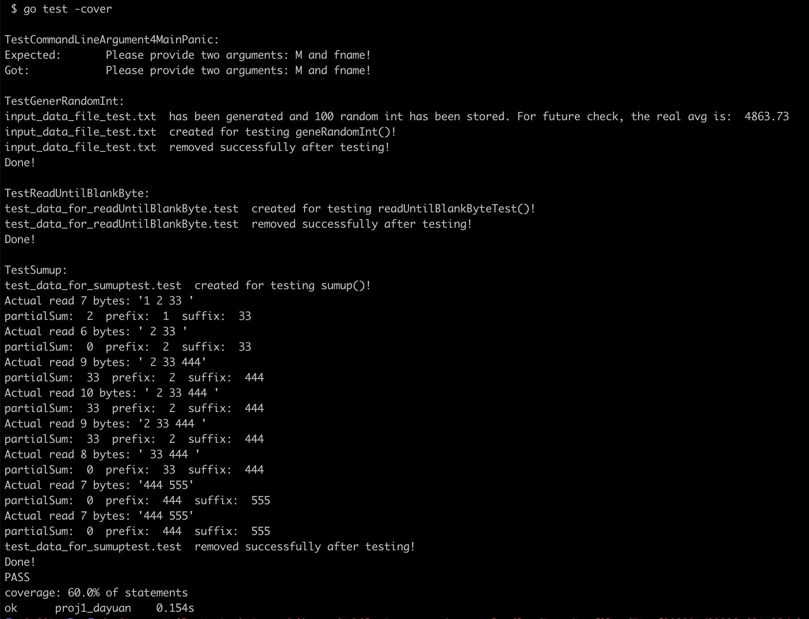

# Project 1
 
Write a GoLang multithreaded (goroutine, concurrency) applications to compute the average of the integers stored in a file. 

## Assignment

Write a GoLang multithreaded applications to compute the average of the integers stored in a file. 
Your program will take two **command-line input parameters**: M and fname. Here M is an integer and fname is the pathname (relative or absolute) to the input data file.
1. The format of the input data file is: a sequence of integers separated by white space, written in ASCII decimal text notation; you may assume that each integer is the ASCII representation of a 64-bit signed integer (and has ~20 digits).
2. Your program should spawn M workers threads and one coordinator thread. The main() of your program simply spawns the coordinator.
3. The workers and the coordinator are to be implemented as goroutines in the GoLang. Workers can communicate with the coordinator but do not communicate among themselves. Use GoLang channels for communication between the workers and the coordinators.
4. The coordinator partitions the data file in M equal-size contiguous fragments; each kth fragment will be given to the kth worker via a JSON message of the form that includes the datafile's filename and the start and end byte position of the kth fragment, eg "{datafile: fname, start: pos1 , end: pos2}" for a fragment with the bytes in the interval [pos1, pos2).
5. Each worker upon receiving its assignment via a JSON message it computes a partial sum and count which is the sum and count of all the integers which are fully contained within its assigned fragment. **It also identifies a prefix or suffix of its fragment that could be part of the two integers that may have been split between its two adjacent (neighboring) fragments.** Upon completion, the worker communicates its response to the coordinator via a JSON message with the **partial** **sum** and **count**, suffix, and prefix of its fragment, as well as it's fragments start and end eg: a worker whose assigned fragment that starts at 40, ends by 55, and contains "1224 5 8 10 678" will respond with the message "{psum: 23, pcount: 3, prefix: '1224 ', suffix: ' 678', start:40, end:55}".
6. The coordinator, upon receving a response from each worker, accumulates all the workers's partial sums and counts, as well as the sums and counts of the couple of integers in the concatenation of kth suffix and (k+1)th prefix (received by the the workers assigned the kth and (k+1)th fragments respectively. Upon receiving responses from all the workers, the coordinator prints and returns the average of the numbers in the datafile.

Your implementation should be correct and efficient by ensuring that
- the coordinator, upon completion, computes the correct sum of the integers in the datafile.
- there are no race conditions.
- has least amount of information (#bytes) communicated between the coordinator and the workers.
- least synchronization delay (elapsed time of syncrhonization between workers and coordinator).
- has least latency time for the coordinator (time difference between the last response received and the coordinator finishing).
- has least response time for the coordinator (time difference between the coordinator starting and the receiving its 1st response from a worker).
- has least elapsed time for the "slowest" worker (the time from when a worker starts and when it finishes).
- has least elapsed time for the coordinator (the time from when the coordinator starts and finishes).

In order to control for distortions (delays due other running processes and the filesystem), 'time' here refer to CPU time rather than wall time (real physical clock time). 

[Assignment HTML](https://www.csee.umbc.edu/~kalpakis/courses/621-sp22/project/prj0.php), [PDF](proj1.pdf)


## Structure


## Run

To run it, use below commands: (here *M=3, fname="input_data_file.txt"*)

```go
cd ...path to.../proj1
go run proj1_dayuan.go 3 input_data_file.txt
```

To check out test:
```go
cd ...path to.../proj1
go test -cover

```

Screenshots:




## Note

- position 0 refers to the first byte. So in the example of "1 2 33 444 555", for [0, 1) you need to read the first byte "1"; [1,5) gets " 2 3"; [2,6) gets "2 33"; [2,7) gets "2 33 ". 

## Reference:

- Golang command line argument https://stackoverflow.com/a/2707480
- main test https://stackoverflow.com/a/33723649
- write into file https://gobyexample.com/writing-files
- check whether a file exist https://stackoverflow.com/a/66405130
- go test -cover and -coverprofile https://stackoverflow.com/a/65454318
- concurrency vs parallelism https://stackoverflow.com/a/1050257
- concurrency vs parallelism vs asynchronization https://stackoverflow.com/questions/4844637/what-is-the-difference-between-concurrency-parallelism-and-asynchronous-methods
- concurrency vs multithreading https://stackoverflow.com/questions/35100102/what-is-the-differene-between-concurrency-and-multithreading
- concurrency in go (goroutine, channel, buffered channel) https://www.youtube.com/watch?v=LvgVSSpwND8
- Go routines (A tour of go) https://go.dev/tour/concurrency/1
- Channel range usage https://gist.github.com/DayuanTan/b01a67b1295d160e63c0a14b60c849bf
- to know how many bytes a file has https://stackoverflow.com/a/17133613 
- Json in go: json.Marshal() json.Unmarshal() https://go.dev/blog/json


