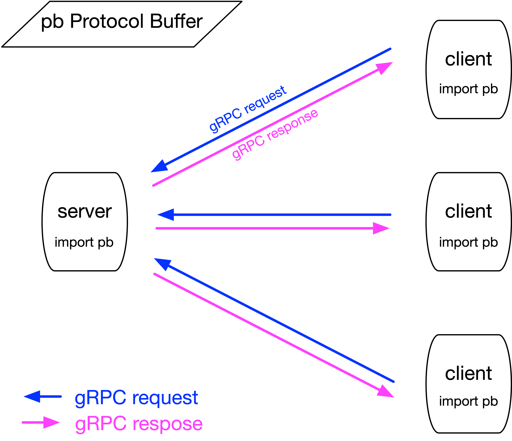
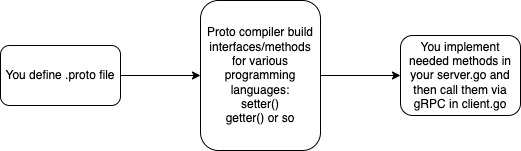

# Proj2 Client-Server Token Manager

Implement a client-server application in Go for the management of tokens.

## Assignment

### Token ADT
A *token* is an abstract data type, with the following properties: *id, name, domain, and state*. 

- Tokens are uniquely identified by their **id**, which is a string. 
- The **name** of a token is another string. 
- The **domain** of a token consists of three uint64 integers: low, mid, and high. 
- The **state** of a token consists of two unit64 integers: a partial value and a final value, which is defined at the integer x in the range [low, mid) and [low, high), respectively, that minimizes **h(name, x)** for a hash function h. The hash **h** to use for this project is the SHA256 as below:

```go
import ( 
    "crypto/sha256"
    "encoding/binary"
    "fmt" 
)
// Hash concatentates a message and a nonce and generates a hash value. 
func Hash(name string, nonce uint64) uint64 {
    hasher := sha256.New() 
    hasher.Write([]byte(fmt.Sprintf("%s %d", name, nonce))) 
    return binary.BigEndian.Uint64(hasher.Sum(nil))
}
```
## Tokens support the following methods:
- **create(id)**: create a token with the given id. Reset the token’s state to “undefined/null”. Return a success or fail response.
- **drop(id)**: to destroy/delete the token with the given id
- **write(id, name, low, high, mid)**:
  1. set the properties name, low, mid, and high for the token with the given id. Assume uint64 integers low <= mid < high.
  2. compute the partial value of the token as argmin_x H(name, x) for x in [low, mid), and reset the final value of the token.
  3. return the partial value on success or fail response
- **read(id)**:
  1. find argmin_x H(name, x) for x in [mid, high)
  2. set the token’s final value to the minimum of the value in step#1 and its partial value
  3. return the token’s final value on success or fail response

## Task

Implement a **client-server solution for managing tokens**. Your **server** should maintain an initially empty (non-persistent) collection of tokens. **Clients** issue **RPC calls** to the server to execute create, drop, read-write methods on tokens. The server executes such **RPCs** and returns an appropriate response to each call. 

Client-server communication is assumed **synchronous**.

Your solution should in developed in **Go** and utilize the **gRPC** and Google **Protocol Buffer** frameworks.

Your **server**, upon completing an RPC call by a client for a token, it should “dump” on stderr or stdout all the information it has for that token, followed by a list of the ids of all of its tokens. The server upon starting, it gets the port number to listen to from the command line arguments/flags, eg.
```
tokenserver -port 50051
```
The server terminates upon receiving a CTRL-C (SIGINT) signal. Your server should allow for maximum concurrency among non-conflicting RPC calls (eg any pair of concurrent RPC calls on the same token conflict unless both are read); conflicting RPC calls should be executed in a serial manner.

Your **client** executes a single RPC call (to a server on the specified host and port) upon fetching the command line arguments/flags, eg
```
tokenclient -create -id 1234 -host localhost -port 50051
tokenclient -write -id 1234 -name abc -low 0 -mid 10 -high 100 -host localhost -port 50051 
tokenclient -read -id 1234 -host localhost -port 50051
tokenclient -drop 1234 -host localhost -port 50051
```
Your client should print on stdout the response it received from the RPC call to the server, and then terminate.

Alternatively, you may have a -config command line flag to specify the filename of a simple YAML (configuration) file with the intended server’s connection information, eg.
```
host: localhost
port: 50051
```

[Assignment PDF](./proj2_gRPC_ProtocolBuffer_ClientServerTokenManager.pdf)


# My solution:

## Structure




## Note



### Note 1. Protocol Buffers
In this project we use google ***Protocol Buffer***. Think it as XML/JSON or similar, but faster, easier, simpler, smaller. The proto compiler ***protoc*** will generate methods (setters/getters and so on) using various programming languages to manipulate the corresponding protocol buffer.


We defined our ***token*** protocol buffer in ```proj2_dayuan/token/token.proto```.

To compile it:
```go
cd ...path to.../proj2_dayuan
proj2_dayuan$ protoc -I=token --go_out=token token/token.proto
```
It generated the file ```proj2_dayuan/token/token.pb.go``` which contains methods we can use. Then we can write message using them.

### Note 2. Write/Read message 

If read from or write to variables: just create instances.

If read from or write to files on disk: using proto.Marshal() and proto.Unmarshal()

### Note 3. Define Services in gRPC

Add service definition and server-side methods in same ```proj2_dayuan/token/token.proto``` file as above.

Next, to generate the gRPC client and server interfaces from our .proto service definition. We did this using the protocol buffer compiler ***protoc*** with a special gRPC Go plugin proto ***protoc-gen-go, protoc-gen-go-grpc***. 

```go
cd ...path to.../proj2_dayuan
proj2_dayuan$ protoc --go_out=. --go_opt=paths=source_relative \
    --go-grpc_out=. --go-grpc_opt=paths=source_relative \
    token/token.proto
```

It generated 2 files ```proj2_dayuan/token/token.pb.go token_grpc.pb.go``` 


### Note 4. Implement Server/Client methods in tokenserver/tokenserver.go and tokenclient/tokenclient.go


To run, either:

```go
cd ...path to.../proj2_dayuan/tokenserver
proj2_dayuan/tokenserver$ go build //this generate file "proj2_dayuan/tokenserver/tokenserver"
proj2_dayuan/tokenserver$ ./tokenserver -port 50051
cd ...path to.../proj2_dayuan/tokenclient
proj2_dayuan/tokenclient$ go build //this generate file "proj2_dayuan/tokenclient/tokenclient"
proj2_dayuan/tokenclient$ ./tokenclient -create -id 123 -host localhost -port 50051
```

or:

```go
cd ...path to.../proj2_dayuan
proj2_dayuan$ go run tokenserver/tokenserver.go -port 50051
proj2_dayuan$ go run tokenclient/tokenclient.go -create -id 12345 -host localhost -port 50051
```

### All  commands I used are:

(A video shows the reuslts when I run below commands.)

- Server side:
```go
proj2_dayuan/tokenserver$ go run tokenserver.go -port 50051
```

Details of commands and corresponding  logs are in [runlog_example/tokenserver.log.md](runlog_example/tokenserver.log.md)

- Client side:
```go
proj2_dayuan/tokenclient$ go run tokenclient.go -create -id 222 -host localhost -port 50051

proj2_dayuan/tokenclient$ go run tokenclient.go -create -id 222 -host localhost -port 50051

proj2_dayuan/tokenclient$ go run tokenclient.go -create -id 12345 -host localhost -port 50051

proj2_dayuan/tokenclient$ go run tokenclient.go -create -id 2222 -host localhost -port 50051

proj2_dayuan/tokenclient$ go run tokenclient.go -write -id 2222 -name def -low 0 -mid 10 -high 100 -host localhost -port 50051

proj2_dayuan/tokenclient$ go run tokenclient.go -write -id 12345 -name abc -low 0 -mid 10 -high 100 -host localhost -port 50051

proj2_dayuan/tokenclient$ go run tokenclient.go -write -id 2 -name def -low 0 -mid 10 -high 100 -host localhost -port 50051

proj2_dayuan/tokenclient$ go run tokenclient.go -read -id 2222 -host localhost -port 50051

proj2_dayuan/tokenclient$ go run tokenclient.go -read -id 12345 -host localhost -port 50051

proj2_dayuan/tokenclient$ go run tokenclient.go -read -id 1234 -host localhost -port 50051

proj2_dayuan/tokenclient$ go run tokenclient.go -drop -id 12345 -host localhost -port 50051

proj2_dayuan/tokenclient$ go run tokenclient.go -read -id 12345 -host localhost -port 50051
```

Details of commands and corresponding  logs are in [runlog_example/tokenclient.log.md](runlog_example/tokenclient.log.md)


## Reference:

1. Protocol Buffers 
   1. Protocol Buffers install https://grpc.io/docs/protoc-installation/
   2. Protocol Buffers How start? https://developers.google.com/protocol-buffers 
   3. Protocol Buffers Overview https://developers.google.com/protocol-buffers/docs/overview 
   4. Protocol Buffer Go tutorial/example https://developers.google.com/protocol-buffers/docs/gotutorial
      - Define message formats in a .proto file.
      - Use the protocol buffer compiler.
      - Use the Go protocol buffer API to write and read messages.
   1. One Example of Protocol Buffer: addressbook 
      - https://github.com/protocolbuffers/protobuf/tree/main/examples
      - https://github.com/protocolbuffers/protobuf/blob/main/examples/addressbook.proto
2. gRPC 
   - Introduction to gRPC https://grpc.io/docs/what-is-grpc/introduction/
   - gRPC install, quick start https://grpc.io/docs/languages/go/quickstart/ 
   - gRPC Basics Tutorial https://grpc.io/docs/languages/go/basics/
     - routeGuide Example Repo https://github.com/grpc/grpc-go/tree/master/examples/route_guide
     - Define Services
     - Generating client and server code
     - Create Server
     - Create Client
       - Call Server Methods
   - gRPC Hellow World Example Repo https://github.com/grpc/grpc-go/tree/master/examples
  